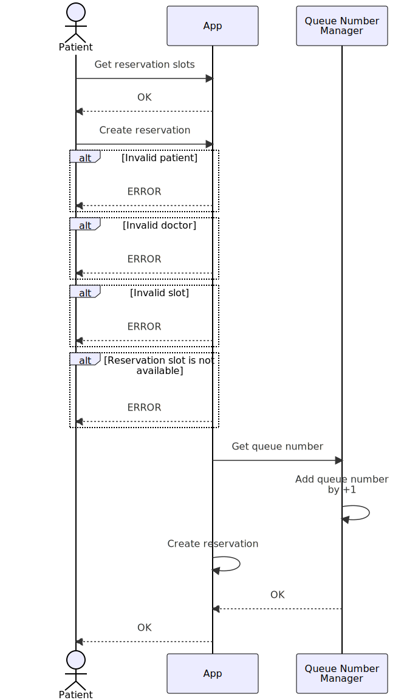

# Product Requirement Document

## Requirements

- Each patients can do a reservation for a consultation
- Reservation is based on clinic slot
- Once a reservation is booked, patient will receive a queue number

## Assumptions

- Reservation slots are configurable but they are the same for everyday (weekday+weekend)
- No restriction for patient's reservation. As long as the doctor is available, reservation is allowed. There is no feature of "doctor approval"
- Every doctors are available everyday
- One doctor can't handle overlapping reservations
- Clinic is open everyday
- Queue number never restarts. It keeps increasing

## Diagrams

### Use Case Diagram

#### Patient Creates a Reservation

#### Patient Cancels a Reservation

#### Patient Get List of Reservations

### ERD

- patients
- doctors
- reservations
- slots?
